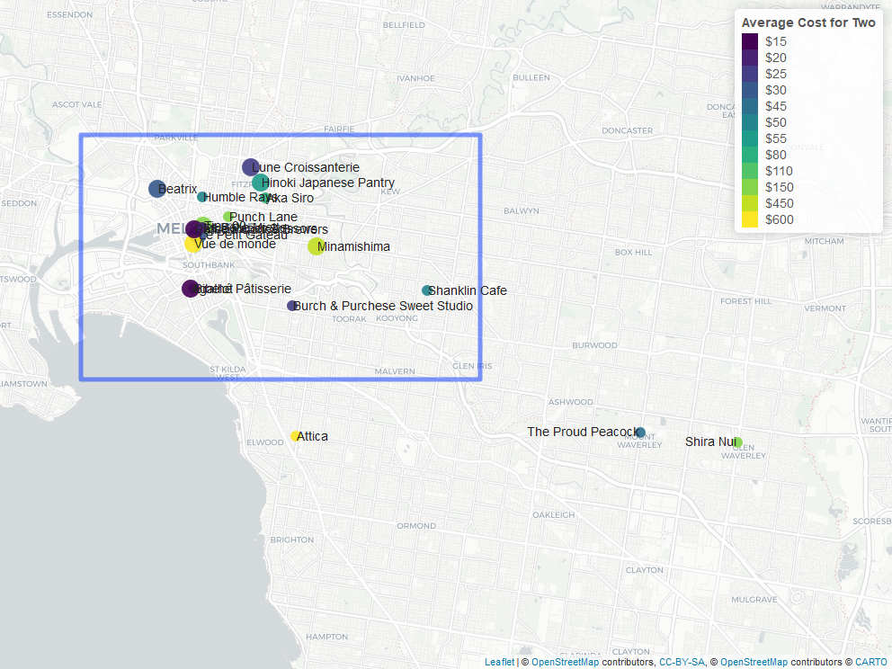
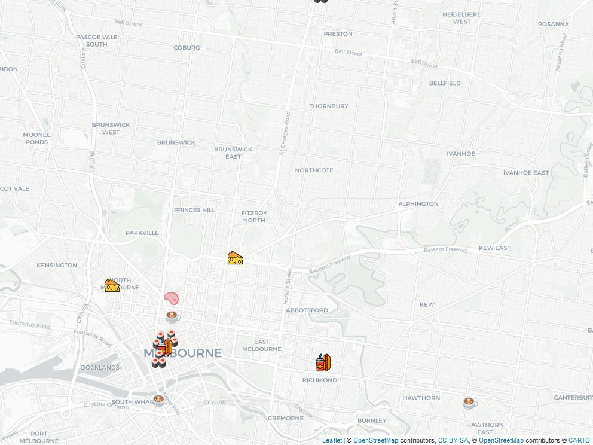

```{r setup, include=FALSE}
knitr::opts_chunk$set(echo = FALSE, 
                      cache=FALSE, 
                      messages=FALSE, 
                      warning=FALSE,
                      fig.pos="H")

library(romato)
library(dplyr)
library(tidyverse)
library(ggplot2)
library(leaflet)
library(readr)
library(mapview)
library(viridis)
library(kableExtra)
library(knitr)
library(plotly)
```


```{r}
# assign API key
zmt <- zomato$new("1623b413d3a1614e765de7578f83a10b") 
```


```{r read data, echo = FALSE, include = FALSE, message = FALSE, warning = FALSE}

# pull data for category "Best of Melbourne" using Melbourne ID "259"
melb <- zmt$search(entity_id = "259", entity_type = "city", category = "Best of Melbourne")

#search restaurant around CBD
melb_top100 <- melb %>% 
  select(-offers, -establishment_types, -all_reviews.reviews, -highlights) %>% 
  mutate(aggregate_rating = as.numeric(aggregate_rating), price_range = as.numeric(price_range), longitude = as.numeric(longitude), latitude = as.numeric(latitude))

```


```{r , include=FALSE}
# viewing "Best of Melbourne" data
melb_top100_filter <- melb_top100 %>%  
  select(name, cuisines, average_cost_for_two, price_range, establishment,all_reviews_count, locality, aggregate_rating, rating_text, address) %>%
  mutate(establishment = as.character(establishment))


melb_top100_filter %>%
  arrange(desc(aggregate_rating)) %>% 
  head(20)
```

\clearpage

\section*{Introduction}   
# Introduction  

For this assignment we will be looking at scrapping data from Zomato, one of the largest foods aggregators in the world @zomato. Zomato provides information on restaurants including, price, location, reviews and more. For the purposes on our analysis we will be looking at the best of Melbourne list @zomatomelb to gain insight into some of the most popular restaurants in Melbourne.   

This report will include four sections looking at:

* Is expensive food better than cheap food?
* Finding the very best restaurants in Melbourne
* Popularity of different cuisine in Melbourne
* Exploring restaurants with gluten free food in Melbourne

In this report we have used the following packages @tidyverse, @romato, @kableExtra, @knitr, @dplyr, @ggplot2, @leaflet, @readr, @mapview, @viridis, @plotly. 


\clearpage  
# Is expensive food better than cheap food?

In this section we will be using the Zomato Best of Melbourne to explore whether expensive food is "better" than cheap food. To conduct this analysis, we will be looking at:

* What is considered cheap and expensive food
* What the breakdown of price ranges of the restaurants is
* Comparing prices and aggregate ratings 
* Determining whether there is a relationship between prices and ratings

## What is considered cheap and expensive food?  

```{r price-ranges,fig.cap= "Price Ranges"}
melb_top100_filter %>%
  mutate(price_range = as.factor(price_range)) %>%
  ggplot(aes(reorder(x=price_range, average_cost_for_two), 
             y = average_cost_for_two, 
             fill = price_range)) +
  geom_boxplot() + 
  labs(title = "Price Ranges",
       x = "Price Range",
       y = "Average Cost for Two",
       fill = "Price Range")
```

From Figure \@ref(fig:price-ranges) we can see Zomato breaks down price ranges into 4 categories with 4 being the most expensive to 1 being the least expensive.

```{r ,include=FALSE}
price_range <- melb_top100_filter %>%
  group_by(price_range) %>%
  summarise(Maximum = max(average_cost_for_two),
            Median = median(average_cost_for_two),
            Minimum = min(average_cost_for_two),
            Range = max(average_cost_for_two)-min(average_cost_for_two))

```

```{r price-range-table, fig.cap= "Price Ranges"}

price_range %>% rename(`Price Range` = price_range) %>% 
  kable(caption = "Price Ranges") %>%
  kable_styling(bootstrap_options = "striped",
                latex_options = "hold_position")
  
```

From Table \@ref(tab:price-range-table) we can see the range of prices that make up each price category.

## What the breakdown of price ranges of the restaurants?   

```{r price-range-count, fig.cap= "Price Range Counts", fig.pos="h", fig.height=4, fig.width=5}
melb_top100_filter %>%
  mutate(price_range = as.factor(price_range)) %>%
  select(name, price_range)%>%
  group_by(price_range)%>%
  count() %>% 
  ggplot(aes(x = price_range, 
             y = n,
             fill = price_range)) +
  geom_bar(stat = "identity", 
           colour = "black") +
  labs(title = "Price Range Counts",
       x = "Price Range",
       y = "Count",
       fill = "Price Range")
```

From Figure \@ref(fig:price-range-count) We can see price range 3 has the most counts. One thing to note however is price range 3 has a range of $40 compared to 1 and 2 which is $10 and $15, respectively. It may be unfair to conclude there is a higher count of more expensive food as the ranges included in the expensive ranges are larger than the lower ones. 


## Comparing prices and aggregate ratings  

```{r price-ratings, fig.cap= "Price Ranges to Aggregate Ratings", echo = FALSE}
melb_top100_filter %>% 
  mutate(price_range = as.factor(price_range)) %>%
  ggplot(aes(x = price_range, y = aggregate_rating, fill = price_range)) +
  geom_boxplot() + 
  labs(title = "Price Ranges to Aggregate Ratings",
       x = "Price Range",
       y = "Aggregate Rating",
       fill = "Price Range")
```

From Figure \@ref(fig:price-ratings) we can see the median aggregate rating for price range 1 is the highest. In fact, we can see a large amount of lower priced restaurants outranking higher priced restaurants in terms of aggregate ratings.

## Is there a relationship between prices and ratings   

```{r cost-rating-relationship, fig.cap= "Average Cost for Two to Aggregate Rating Relationship", echo = FALSE, warning= FALSE, message= FALSE}

melb_top100_filter %>%
  select(name, average_cost_for_two,aggregate_rating) %>%
  mutate(average_cost_for_two = as.numeric(average_cost_for_two)) %>%
  ggplot(aes(x = average_cost_for_two,
             y = aggregate_rating)) +
  geom_point() +
  geom_smooth() +
  labs(title = "Average Cost for Two to Aggregate Rating Relationship",
       x = "Average Cost for Two",
       y = "Aggregate Rating")
```

From Figure \@ref(fig:cost-rating-relationship) we can see there is not a strong relationship between the average cost for two and the aggregate ratings suggesting there is no relationship between price and food quality. We see a slight upwards trend at the higher price levels. However, this is only based on 5 restaurants with drastically higher prices. We see most of the restaurants fall below the $200 price point. This might even suggest lower priced restaurants out rank the higher priced restaurants due to the higher count.


```{r include = FALSE}
rating <- melb_top100_filter %>%
  group_by(rating_text) %>%
  summarise(Maximum = max(aggregate_rating),
            Minimum = min(aggregate_rating))


```

```{r rating-ranges, fig.cap= "Rating Ratings"}
rating %>% 
  rename(`Rating Text` = rating_text) %>%
  kable(caption = "Rating Ranges") %>%
  kable_styling(bootstrap_options = "striped",
                latex_options = "hold_position")
  
```

Table \@ref(tab:rating-ranges) shows range of aggregate ratings that make up each rating levels.

```{r rating-count, fig.cap= "Average Rating Count"}
melb_top100_filter$rating_text <- factor(melb_top100_filter$rating_text, levels = c("Average", "Good", "Very Good", "Excellent"))
melb_top100_filter %>%
  mutate(price_range = as.factor(price_range)) %>%
  group_by(price_range, rating_text) %>%
  count(na.rm = TRUE) %>%
  ggplot(aes(x = rating_text,
             y = n,
             fill = price_range)) +
  geom_bar(position = "dodge", stat = "identity", colour = "black") +
  labs(title = "Average Rating Count",
       x = "Average Rating",
       y = "Count",
       fill = "Price Range")
```

From Figure \@ref(fig:rating-count) we can see restaurants in the second and fourth price category all rank in either the very good or excellent category. 3 has the highest count in all categories, however, this may be due to the higher count. We see all price levels have restaurants with high ratings. 

\clearpage

 
# Finding The Very Best Restaurants of Melbourne

This section is covering composition and distribution of the very best restaurants in Melbourne-Victoria. In order to find the very best restaurant, this report will filter out 100 restaurants which are listed in **"Best of Melbourne"** category on Zomato's website. The very best restaurants are described as one which has rating equals to or more than 4.8 out of 5.
After filtered out the dataset, several highest-rated restaurants fill the top list as shown in table \@ref(tab:best-restaurant).

```{r include=FALSE}

melb_best <- melb_top100 %>% 
  filter(aggregate_rating >= 4.8) %>% 
      as.data.frame()

summary(melb_best)
```


```{r best-restaurant, echo=FALSE}
melb_best_resto <- melb_best %>% 
  select(name, cuisines, locality, price_for_two = average_cost_for_two, rating = aggregate_rating) %>% 
  filter(rating >= 4.8) %>% 
  arrange(desc(rating)) %>% 
  kable(caption = "The Very Best Restaurants in Melbourne According to Zomato Rating") %>% 
  kableExtra::kable_styling(latex_options = c("striped", "hold_position"), stripe_color  = "pink", font_size = 8)

melb_best_resto
```


From table \@ref(tab:best-restaurant) above, there are twelve restaurants which have minimum rating 4.8 out of 5 hence can be described as the very best restaurants in Melbourne. The prices, cuisines and locations in the top list are vary but with some patterns that will be further explored in the following paragraphs.

```{r create-map, include=FALSE}

pal <- colorFactor(palette = "viridis", melb_best$average_cost_for_two)

map_melb <- leaflet(melb_best) %>%
  addTiles() %>% 
  addProviderTiles(providers$CartoDB, options = providerTileOptions(opacity = 1)) %>% 
  addCircleMarkers(lng = melb_best$longitude, 
                   lat = melb_best$latitude, 
                   label = melb_best$name,
  labelOptions = labelOptions(textOnly = T, noHide = T, textsize = "14px"),
  radius = ~ifelse(melb_best$aggregate_rating > 4.8, 10, 6),
  color = ~pal(melb_best$average_cost_for_two),
  stroke = FALSE, fillOpacity = 0.9
  ) %>% 
  addLegend("topright", pal = pal, values = ~average_cost_for_two,
    title = "Average Cost for Two",
    labFormat = labelFormat(prefix = "$"),
    opacity = 1) %>% 
  setView(lng = 145.054570, lat = -37.846302, zoom = 12.44) %>% 
  addRectangles(
    lng1= 144.915218, lat1= -37.86,
    lng2= 145.067654, lat2= -37.786092,
    fillColor = "transparent"
  )

map_melb

mapshot(map_melb, file = paste0(getwd(), "/map.png"))

```

```{r maps, fig.cap="Best of Melbourne", out.width= "70%", fig.align='center', echo = FALSE, eval = FALSE}

```

Regarding the average price and location of the restaurants, figure \@ref(fig:maps) shows the map plot of these highest-rated restaurants with their attribute of average food price for two person. The average price for two persons is differentiated by color, while larger circle indicates higher rating (4.9).

It is seen from the figure \@ref(fig:maps) that three restaurants are located in CBD, which is not surprising given the nature of CBD as the epicenter of Melbourne. Other restaurants are relatively still located close to CBD like Fitzroy, North Melbourne, Carlton and Hawthorn where eight restaurants base in. One outlier from the list is Shira Nui restaurant, where its location is quite far away from other restaurants in the group. This Japanese-sushi restaurant is located in Glen Waverley suburb which is about one and half hour driving from the CBD.


```{r include=FALSE}
#creating dataset for map
melb_icon <- melb_best %>% 
  select(name, locality, cuisines, longitude, latitude, rating = aggregate_rating) %>% 
   mutate(food_type = str_extract(cuisines, c("Korean", "Sushi", "Coffee", "Coffee", "Australian","Australian", "Sushi", "Sushi", "French","French", "Coffee", "Sushi"))) %>% 
  filter(rating >= 4.8) %>% 
  group_by(locality)

melb_icon

```


```{r include=FALSE}

sushicon <- icons(
  iconUrl = "https://i.imgur.com/7KibpoF.png",
  iconWidth = 25, iconHeight = 30,
  iconAnchorX = 22, iconAnchorY = 40,
  )

auscon <- icons(
  iconUrl = "https://i.imgur.com/CarRew0.png",
  iconWidth = 25, iconHeight = 30,
  iconAnchorX = 22, iconAnchorY = 40,
  )

bbqcon <- icons(
  iconUrl = "https://i.imgur.com/bkvbKSQ.png",
  iconWidth = 25, iconHeight = 30,
  iconAnchorX = 22, iconAnchorY = 40,
  )

frencon <- icons(
  iconUrl = "https://i.imgur.com/P7yAbFI.png",
  iconWidth = 25, iconHeight = 30,
  iconAnchorX = 22, iconAnchorY = 40,
  )

cofcon <- icons(
  iconUrl = "https://i.imgur.com/xFmLqpO.png",
  iconWidth = 25, iconHeight = 30,
  iconAnchorX = 22, iconAnchorY = 70,
  )

mapico <- leaflet(melb_icon) %>%
  addTiles() %>% 
  addProviderTiles(providers$CartoDB, options = providerTileOptions(opacity = 1)) %>% 
addMarkers(
  melb_icon$longitude[1], melb_icon$latitude[1],
  icon = bbqcon) %>%
addMarkers(melb_icon$longitude[2], melb_icon$latitude[2],
  icon = sushicon,
  label = ~melb_icon$name[2]) %>%
addMarkers(
  melb_icon$longitude[3], melb_icon$latitude[3],
  icon = cofcon,
  label = ~melb_icon$name[3])%>% 
addMarkers(
  melb_icon$longitude[4], melb_icon$latitude[4],
  icon = cofcon,
  label = ~melb_icon$name[4])%>% 
addMarkers(
  melb_icon$longitude[5], melb_icon$latitude[5],
  icon = auscon,
  label = ~melb_icon$name[5])%>% 
  addMarkers(
  melb_icon$longitude[6], melb_icon$latitude[6],
  icon = auscon,
  label = ~melb_icon$name[6])%>% 
addMarkers(
  melb_icon$longitude[7], melb_icon$latitude[7],
  icon = sushicon,
  label = ~melb_icon$name[7])%>% 
addMarkers(
  melb_icon$longitude[8], melb_icon$latitude[8],
  icon = sushicon,
  label = ~melb_icon$name[8])%>% 
addMarkers(
  melb_icon$longitude[9], melb_icon$latitude[9],
  icon = frencon,
  label = ~melb_icon$name[9])%>% 
addMarkers(
  melb_icon$longitude[10], melb_icon$latitude[10],
  icon = frencon,
  label = ~melb_icon$name[10])%>% 
addMarkers(
  melb_icon$longitude[11], melb_icon$latitude[11],
  icon = cofcon,
  label = ~melb_icon$name[11]) %>% 
addMarkers(
  melb_icon$longitude[12], melb_icon$latitude[12],
  icon = sushicon,
  label = ~melb_icon$name[12])

mapico

mapshot(mapico, file = paste0(getwd(), "/map_icon.jpeg"))

```

Furthermore, 4 out of 12 highest-rated restaurants in Melbourne are Japanese-Sushi Restaurants, three are coffee shops, while the rest are french and Australian food restaurants as indicated by figure \@ref(fig:map-icon). This fact support an opinion that "Japanese food is still growing since UNESCO declared Japanese cuisine to be an Intangible Cultural Heritage in 2013" @sushi.

```{r map-icon, fig.cap="Sushi Restaurants are Dominating Top List", out.width= "70%", fig.align='center', eval = FALSE,}

```

Furthermore, 4 out of 12 highest-rated restaurants in Melbourne are Japanese-Sushi Restaurants, three are coffee shops, while the rest are french and australian food restaurants as shown by figure \@ref(fig:map-icon).
This fact support an opinion that "japanese food is still growing since UNESCO declared Japanese cuisine to be an Intangible Cultural Heritage in 2013" @sushi.

\clearpage
  
# Popularity of different cuisines in Melbourne

In this section we will look at the popularity of different cuisines in Melbourne. The analysis is based on the total votes restaurants serving these cuisine have.

```{r wrangling, echo=FALSE, include=FALSE}
melb_top100 <- melb_top100 %>% mutate(Types_of_cuisine=melb_top100$cuisines)

temp_1 <- as.data.frame(melb_top100$cuisines[grep("Japanese", melb_top100$cuisines)])
temp_2 <- as.data.frame(melb_top100$cuisines[grep("Chinese", melb_top100$cuisines)])
temp_3 <- as.data.frame(melb_top100$cuisines[grep("Korean", melb_top100$cuisines)])
temp_4 <- as.data.frame(melb_top100$cuisines[grep("Italian", melb_top100$cuisines)])
temp_5 <- as.data.frame(melb_top100$cuisines[grep("Australian", melb_top100$cuisines)])
temp_6 <- as.data.frame(melb_top100$cuisines[grep("Coffee", melb_top100$cuisines)])

for (i in seq_along(melb_top100$Types_of_cuisine)) {
    melb_top100$Types_of_cuisine[[i]][melb_top100$Types_of_cuisine[[i]] %in% temp_1$`melb_top100$cuisines[grep("Japanese", melb_top100$cuisines)]`] <- "Japanese"
    melb_top100$Types_of_cuisine[[i]][melb_top100$Types_of_cuisine[[i]] %in% temp_2$`melb_top100$cuisines[grep("Chinese", melb_top100$cuisines)]`] <- "Chinese"
    melb_top100$Types_of_cuisine[[i]][melb_top100$Types_of_cuisine[[i]] %in% temp_3$`melb_top100$cuisines[grep("Korean", melb_top100$cuisines)]`] <- "Korean"
    melb_top100$Types_of_cuisine[[i]][melb_top100$Types_of_cuisine[[i]] %in% temp_4$`melb_top100$cuisines[grep("Italian", melb_top100$cuisines)]`] <- "Italian"
    melb_top100$Types_of_cuisine[[i]][melb_top100$Types_of_cuisine[[i]] %in% temp_5$`melb_top100$cuisines[grep("Australian", melb_top100$cuisines)]`] <- "Australian"
    melb_top100$Types_of_cuisine[[i]][melb_top100$Types_of_cuisine[[i]] %in% temp_6$`melb_top100$cuisines[grep("Coffee", melb_top100$cuisines)]`] <- "Cafes"
}

melb_top100
```

```{r Cuisine-Type, echo = FALSE, fig.cap = "Number of restaurants for different Cuisines in Melbourne"}
cuisines_melb <- melb_top100 %>%
  select(Types_of_cuisine)%>%
  group_by(Types_of_cuisine)%>%
  count() %>%
  arrange(desc(n))

cuisines_melb %>%
  ggplot(aes(x = n, y = Types_of_cuisine))+
           geom_bar(stat = "identity")+
  xlab("Count") +
  ylab("Types of Cuisine")
```

From Figure \@ref(fig:Cuisine-Type), we can see that Japanese cuisine dominates the Melbourne CBD area, with more than 25 restaurants. Korean and Chinese cuisine are second popular with more than 10 restaurants serving these cuisine in the CBD Area. Also we see that CBD has lots of Cafes which can be related to the nature of the area given that CBD is a business hub with a fast pace environment. According to @Coffee while many people still rely on a quick takeaway on their way to work or on a break from the office, many cafe’s have transformed into restaurants and dining spaces where people can enjoy their hot beverage over a meal or even just to sit down with friends or work colleagues.

```{r ,include= FALSE}
#glimpse(melb_top100)
melb_top100$votes <- as.double(melb_top100$votes)

cuisines_melb_ratings <- melb_top100 %>%
  select(Types_of_cuisine, votes)%>%
  group_by(Types_of_cuisine)%>%
  summarise(Total_Votes = sum(votes)) %>%
  arrange(desc(Total_Votes))

```


```{r Cuisine-Votes, echo = FALSE, fig.cap = "Number of Votes for different Cuisines in Melbourne"}
cuisines_melb_ratings %>%
  ggplot(aes(x = Total_Votes, y = Types_of_cuisine))+
           geom_bar(stat = "identity", fill= "blue") +
  labs(x = "Total Votes",
      y = "Types of Cuisine")
```

From Figure \@ref(fig:Cuisine-Votes), we can look at the number of votes for different cuisine types. The popularity of a cuisine can largely be explained the number of votes it gets. Japanese cuisine is very popular. According to @ATR, 'Chefs and restaurant owners agree diners have become more discerning and want healthy, sustainable and honest food'. The growing popularity has made Japanese restaurants a regular feature on the top restaurants list. 


```{r , include = FALSE, echo = FALSE}
japanese_restro <- melb_top100 %>% filter(Types_of_cuisine == "Japanese") %>%
  select(name,votes,locality,aggregate_rating)%>%
  group_by(name,locality,aggregate_rating)%>%
  summarise(Total_Votes = sum(votes)) %>%
  arrange(desc(Total_Votes)) %>%
  head(10)
```

```{r top10-Jap, echo=FALSE}
kable(japanese_restro, "latex", caption = "Top 10 voted Japanese restaurants in Melbourne", booktabs = T) %>%
kable_styling(latex_options = c("striped", "hold_position"))
```

In Table \@ref(tab:top10-Jap) we can look at the top ten popular Japanese restaurants with votes count and the locality they are in.

\clearpage


# Exploring gluten free food/restaurants in Melbourne

In this section we will be looking into restaurants with gluten free food.  

We will explore high end restaurants which offer gluten free food.
To look for a good restaurant we will be using aggregate ratings.
Popular restaurants will have more then 500 reviews. 
Being realistic, calculating average cost for one person's meal.
Most Instagramable place.


## Checking out the category "Gluten-Free"!

For diet conscious people and people with Gluten Allergy.

```{r}
glu <- zmt$search(entity_id = "259", entity_type = "city", category = "Gluten-Free")
```


## Selecting appropriate variables and being realistic!

Picking required variables.

```{r}
glut <- glu %>% select(name, 
                       average_cost_for_two, 
                       all_reviews_count, 
                       photo_count, 
                       locality, 
                       aggregate_rating)  %>% 
  mutate(
    avg_cost_for_one = average_cost_for_two/2)
```


## Making an easy to understand table!


```{r rest-gluten-free, echo = FALSE, fig.align= "left"}

glute <- glut %>% filter(aggregate_rating > 4.5) %>% 
  select(name, 
                       avg_cost_for_one, 
                       all_reviews_count, 
                       photo_count, 
                       locality, 
                       aggregate_rating) %>%
arrange(locality)


glute_kable <- glute %>%
  kable(caption = "Top Options") %>%
  kable_styling(latex_options= c("striped", "condensed", "hold_position"), full_width = F, font_size = 8)

glute_kable


```

The Table \@ref(tab:rest-gluten-free) shows the name of the restarunts in Melbourne, their locality, number of reviews recieved, aggregate ratings, photo count and how much it costs for one persons gluten free meal on average. 

## Visualizing findings!


```{r review-price-relation, fig.cap= "Worth the money!", fig.align = "center"}

gluten <- ggplot(glute,  
                 aes(x = all_reviews_count, 
                     y = avg_cost_for_one, 
                     color = name))  +
  geom_point() +
   facet_wrap(~aggregate_rating
              ) + 
  geom_vline(xintercept = 500, 
             color = "red"
             ) + 
  labs(x = "all reviews count",
       y = "average cost for one") +
  theme(legend.position = "bottom",
        legend.text = element_text(size = 5),
        legend.title = element_text(size = 5))


gluten
```

The graph Figure \@ref(fig:review-price-relation) shows top restaurants in Melbourne, using the category "gluten free", with an intercept at 500 reviews count. In the highest rating of 4.9, Lune Croissanterie is the best restaurant with very reasonable average price of 12.50 AUD per person. While, Vue de monde is second on the list with a rating of 4.8 but very pricy at an average cost of 300 AUD.


```{r instagrammable-plot, fig.cap = "Can I instagram it?",fig.align = "center"}

glutenf <- ggplot(glute,  
                 aes(x = all_reviews_count, 
                     y = photo_count, 
                     color = name))  +
  geom_point() +
   facet_wrap(~aggregate_rating
              ) + 
  geom_vline(xintercept = 500, 
             color = "red"
             ) + 
  labs(x = "all reviews count",
       y = "photo count") +
  theme(legend.position = "bottom",
        legend.text = element_text(size = 5),
        legend.title = element_text(size = 5))

glutenf
```

The graph Figure \@ref(fig:instagrammable-plot) visualizes restaurants with good reviews and potential of each restaurant on how much instagrammable it is. Lune Croissanterie has the best review rating with a high photo count of 1813. While, The Hardware Societe has the highest photo count at 4224, with a good rating of 4.6.

In Table \@ref(tab:top10-Jap) we can look at the top 10 popular Japanese restaurants in Melbourne along with their location and rating. 'Don-Don' is a very popular Japanese restaurant with 3168 votes. 'Shira Nui' is the highest rated restaurant with an aggregated rating of 4.8 out of 5.

The graph Figure \@ref(fig:instagrammable-plot) visualizes restaurants with good reviews and potential of each restaurant on how much instagrammable it is. Lune Crissantete has the best review rating with a high photo count of 1813. While, The Hardware Societe has the highest photo count at 4224, with a good rating of 4.6.


\clearpage 

# Conclusion

* From this analysis we find there is no real relationship between restaurant prices and quality suggesting expensive food is not better than cheap. 
* Melbourne has a strong multicultural cuisines options for people to choose from. Japanese being the most popular has the highest number of restaurants. Popularity of Cafes are also high.
* Most of the very best restaurants in Melbourne is located near CBD. 
* Melbourne has quite a few good restaurants which serve gluten free food with a high review count. Most of the the same restaurants have a high photo count as well hence it is instagrammable in my opinion.

\clearpage


